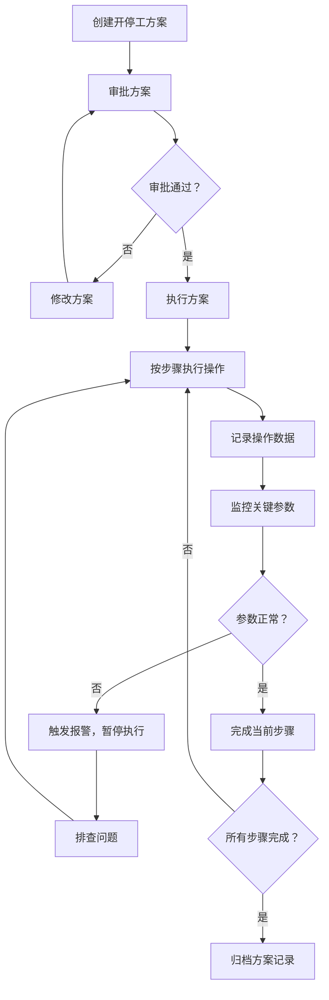

## 1. 产品概述

炼油厂催化裂化装置业务Web管理系统，用于炼油运行部对催化裂化装置进行全面管理，涵盖装置运行、催化剂管理、工艺监控等核心业务。系统服务于炼油厂工艺工程师、装置操作人员、设备管理人员，实现生产过程的数字化管理与智能监控。

## 2. 核心特性

### 2.1 用户角色

| 角色 | 注册方式 | 核心权限 |
|------|----------|----------|
| 系统管理员 | 内部账号分配 | 用户管理、系统配置、数据备份 |
| 工艺工程师 | 内部账号分配 | 工艺参数调整、开停工方案制定、数据分析 |
| 装置操作员 | 内部账号分配 | 日常操作记录、参数监控、设备点检 |
| 设备管理员 | 内部账号分配 | 设备管理、维护记录、跑损统计 |

### 2.2 功能模块

1. **装置开停工**：开停工方案管理、步骤跟踪、状态监控
2. **催化剂管理**：催化剂藏量监控、跑损统计、生命周期管理
3. **反应再生**：反应器温度监控、再生器烧焦管理、待生剂循环
4. **分馏吸收**：分馏塔操作、吸收稳定系统、油浆外甩管理
5. **能量回收**：烟气能量回收、余热利用、能耗统计
6. **参数监控**：关键参数趋势、实时数据、报警管理
7. **设备点检**：机泵运行点检、设备状态、维护记录

### 2.3 页面详情

| 页面名称 | 模块名称 | 功能描述 |
|----------|----------|----------|
| 首页仪表盘 | 总览 | 关键指标概览、运行状态总览、报警信息、快捷操作入口 |
| 装置开停工 | 装置开停工 | 开停工方案列表、方案详情、步骤执行进度、历史记录 |
| 催化剂管理 | 催化剂管理 | 催化剂藏量实时数据、跑损统计报表、催化剂台账、补充记录 |
| 反应再生 | 反应再生 | 反应器温度分布、再生器烧焦负荷、待生剂循环流量、汽提蒸汽参数 |
| 分馏吸收 | 分馏吸收 | 分馏塔各点温度压力、吸收稳定系统参数、油浆外甩流量记录 |
| 能量回收 | 能量回收 | 烟气轮机运行数据、余热锅炉参数、能量回收效率、能耗统计 |
| 参数监控 | 参数监控 | 关键参数趋势图、实时数据看板、超限报警、历史数据查询 |
| 设备点检 | 设备点检 | 机泵运行状态、点检记录、设备台账、维护计划 |

## 3. 核心流程

### 3.1 装置开停工流程

### 3.2 日常参数监控流程

操作人员登录系统 → 查看实时参数仪表盘 → 检查报警信息 → 记录设备点检数据 → 处理异常情况 → 生成运行报表

### 3.3 催化剂管理流程

催化剂入库 → 装填记录 → 实时藏量监控 → 跑损统计分析 → 催化剂补充/更换 → 生命周期评估

## 4. 用户界面设计

### 4.1 设计风格

**工业/实用主义风格**，强调数据的清晰度和操作的高效性：
- **主色调**：深蓝 (#165DFF) 作为工业专业感的主色，配合深灰背景
- **辅助色**：橙色 (#FF7D00) 用于报警和警告，绿色 (#00B42A) 表示正常运行，红色 (#F53F3F) 表示严重异常
- **字体**：采用 "JetBrains Mono" 作为数字显示字体，"PingFang SC" 作为中文界面字体，确保数据的可读性
- **按钮风格**：矩形带细微圆角，强调点击反馈，工业感十足
- **布局风格**：模块化卡片布局，顶部导航 + 左侧菜单，最大化数据展示区域
- **图标风格**：线性工业图标，简洁明了，避免花哨装饰

### 4.2 页面设计概览

| 页面名称 | 模块名称 | UI元素 |
|----------|----------|--------|
| 首页仪表盘 | 总览 | 状态卡片网格、关键指标数字展示、趋势图预览、报警列表、深色工业背景 |
| 装置开停工 | 装置开停工 | 方案列表表格、时间线步骤展示、进度条、状态标签、操作按钮组 |
| 催化剂管理 | 催化剂管理 | 藏量仪表盘、跑损趋势折线图、数据表格、柱状图对比、筛选控件 |
| 反应再生 | 反应再生 | 温度分布热力图、再生器示意图、实时数据卡片、参数调节面板 |
| 分馏吸收 | 分馏吸收 | 分馏塔模拟图、温度压力曲线、油浆流量记录表格 |
| 能量回收 | 能量回收 | 能量流向图、效率仪表盘、能耗统计柱状图、烟气参数面板 |
| 参数监控 | 参数监控 | 多参数趋势图、实时数据看板、报警状态指示、时间范围选择器 |
| 设备点检 | 设备点检 | 设备状态卡片网格、点检记录表、维护日历、机泵运行参数 |

### 4.3 响应式设计

- **桌面优先**：针对1920×1080及以上分辨率优化，多列数据展示
- **平板适配**：1024px断点，调整为2-3列布局，保持数据表格可读性
- **移动端**：768px断点，单列布局，重点展示报警和关键指标，表格支持横向滚动
- **触控优化**：按钮最小尺寸44×44px，确保操作便捷

### 4.4 数据可视化指南

- **环境风格**：深色工业背景，配合发光效果的图表数据系列
- **灯光设置**：数据点带有微妙的光晕效果，模拟工业控制面板的LED指示灯
- **动效设计**：数据更新时的平滑过渡动画，报警状态的呼吸灯效果
- **图表类型**：折线图用于趋势分析，柱状图用于对比统计，仪表盘用于关键指标，热力图用于温度分布
- **性能控制**：图表数据按需加载，实时数据采用WebSocket推送，避免频繁刷新
