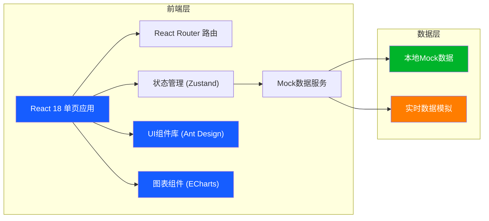
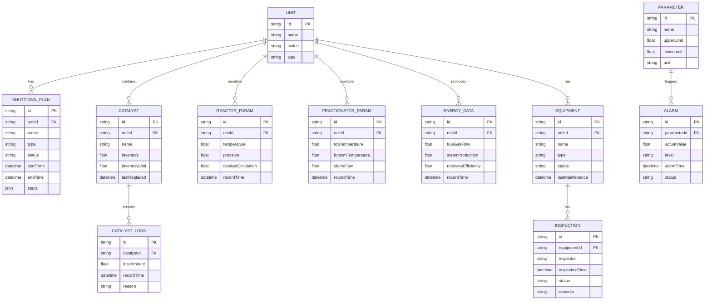

## 1. 架构设计



## 2. 技术描述

- **前端框架**：React@18 + TypeScript
- **构建工具**：Vite@5
- **样式方案**：TailwindCSS@3 + 自定义CSS变量
- **UI组件库**：Ant Design@5
- **图表组件**：ECharts@5
- **路由管理**：React Router@6
- **状态管理**：Zustand@4
- **数据方案**：本地Mock数据，模拟实时数据更新
- **图标库**：Lucide React

## 3. 路由定义

| 路由路径 | 页面名称 | 模块归属 |
|----------|----------|----------|
| `/` | 首页仪表盘 | 总览 |
| `/startup-shutdown` | 装置开停工 | 装置开停工 |
| `/catalyst` | 催化剂管理 | 催化剂管理 |
| `/reaction-regeneration` | 反应再生 | 反应再生 |
| `/fractionation` | 分馏吸收 | 分馏吸收 |
| `/energy-recovery` | 能量回收 | 能量回收 |
| `/monitoring` | 参数监控 | 参数监控 |
| `/equipment` | 设备点检 | 设备点检 |

## 4. 数据模型

### 4.1 数据模型定义



### 4.2 目录结构

```
src/
├── assets/              # 静态资源
├── components/          # 公共组件
│   ├── Layout/          # 布局组件
│   ├── Dashboard/       # 仪表盘组件
│   ├── Charts/          # 图表组件
│   └── Common/          # 通用组件
├── pages/               # 页面组件
│   ├── Dashboard/       # 首页仪表盘
│   ├── StartupShutdown/ # 装置开停工
│   ├── Catalyst/        # 催化剂管理
│   ├── Reaction/        # 反应再生
│   ├── Fractionation/   # 分馏吸收
│   ├── EnergyRecovery/  # 能量回收
│   ├── Monitoring/      # 参数监控
│   └── Equipment/       # 设备点检
├── store/               # 状态管理
├── mock/                # Mock数据
├── types/               # TypeScript类型定义
├── utils/               # 工具函数
├── App.tsx
├── main.tsx
└── index.css
```

## 5. 核心技术决策

### 5.1 实时数据模拟

- 使用 `setInterval` 模拟实时数据更新，每2-5秒随机更新关键参数
- 数据波动范围符合实际炼油工艺参数范围
- 报警状态根据随机生成的参数值与阈值比较自动触发

### 5.2 图表实现

- 使用 ECharts 实现所有数据可视化
- 折线图：参数趋势分析、催化剂跑损趋势
- 柱状图：能耗统计、催化剂对比
- 仪表盘：关键指标实时显示（温度、压力、效率）
- 热力图：反应器温度分布

### 5.3 样式方案

- TailwindCSS 实现快速布局
- 自定义CSS变量定义工业风格主题色
- 深色主题为主，配合数据发光效果
- 响应式断点：1920px、1024px、768px

### 5.4 状态管理

- Zustand 轻量级状态管理
- 全局状态存储：用户信息、报警信息、实时参数
- 页面级状态通过组件内部 `useState` 管理

### 5.5 Mock数据规范

- 所有数据符合炼油厂催化裂化装置实际参数范围
- 温度范围：450-750°C
- 压力范围：0.1-0.4 MPa
- 催化剂藏量：100-200 吨
- 数据生成带有合理的随机波动，模拟真实生产环境
